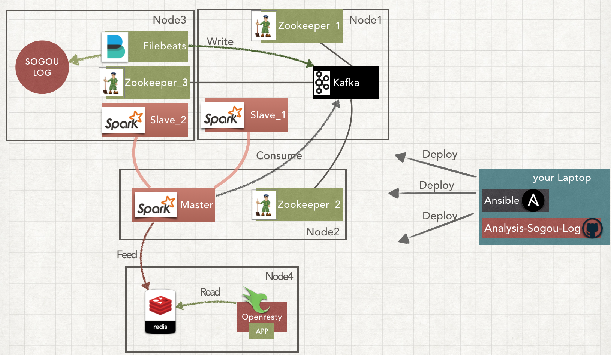
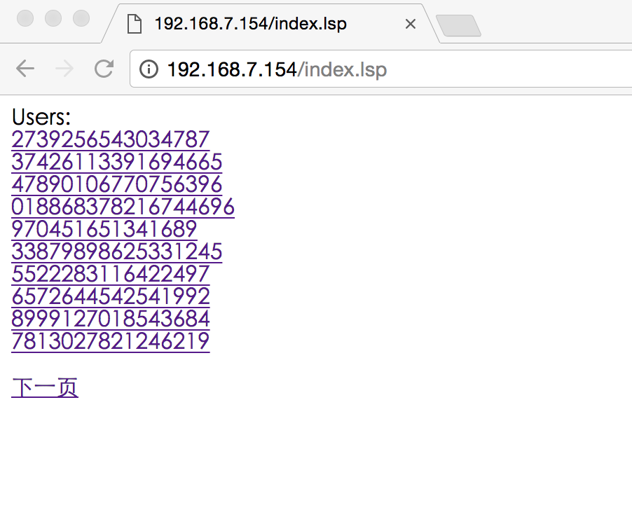

### purpose of this project
To learn Spark Streaming through analysing user query's log opened by [Sogou Lab](http://www.sogou.com/labs/resource/q.php)

The format of user query's log is:

`访问时间\t用户ID\t[查询词]\t该URL在返回结果中的排名\t用户点击的顺序号\t用户点击的URL`

After analysing by Spark Streaming, we'll get 2 lists: user list and hot word list.

### setup environment

1. prepare 4 machines with ubuntu 16.04 to run Spark, Kafka, Zookeeper, Redis, Openresty. I set up 4 machines in my laptop through [Vagrant](https://www.vagrantup.com/) and [VirutalBox](https://www.virtualbox.org/) a kind of virtualization technologies. The IP of these machines is from 192.168.7.151 to 192.168.7.154

1. install [Ansible 2.0 +](http://docs.ansible.com/ansible/intro.html) in your laptop for deploying application automatically

1. install [Maven](http://maven.apache.org/) in you laptop for compliling and packeging java code

1. git clone https://github.com/bigdata-labs/analysis-sogou-log.git

1. download jdk-8u66-linux-x64.tar.gz by yourself place to {{project_path}}/ansible/roles/jdk8/files. Cause many softwares dependens on jdk.

### the system architecture diagram

### get start

1. cd analysis-sogou-log

1. `ansible-playbook ./ansible/playbook.yml -i ./ansible/inventory -u vagrant -k`

   Password for vagrant user is vagrant.
   
   P.S. install kafka, spark, zookeeper and so on. it'll take a few minutes.

1. Assembly our Java code in sogouAnalysis: `mvn assembly:assembly` 

   P.S. It'll genergete two jars that will be submitted to spark's cluster to run

1. `ansible-playbook ./ansible/deploy-playbook.yml -i ./ansible/inventory -u vagrant -k`

   P.S. This step will upload sample data and jars that previews step genertate to spark's cluster, then submit spark's job.   
  
   A few minutes later, open http://192.168.7.152:8080 to look up Spark webui to get the reult.

   

1. `ansible-playbook ./ansible/deployapp.yml -i ./ansible/inventory -u vagrant -k`
    
    deploy a app base on Openresty to consume the data in Redis server.

   
1. access user list: http://192.168.7.154/index.lsp

	

1. access hot word list: http://192.168.7.154/hotword.lsp

	

Sorry for my poor English. :P

