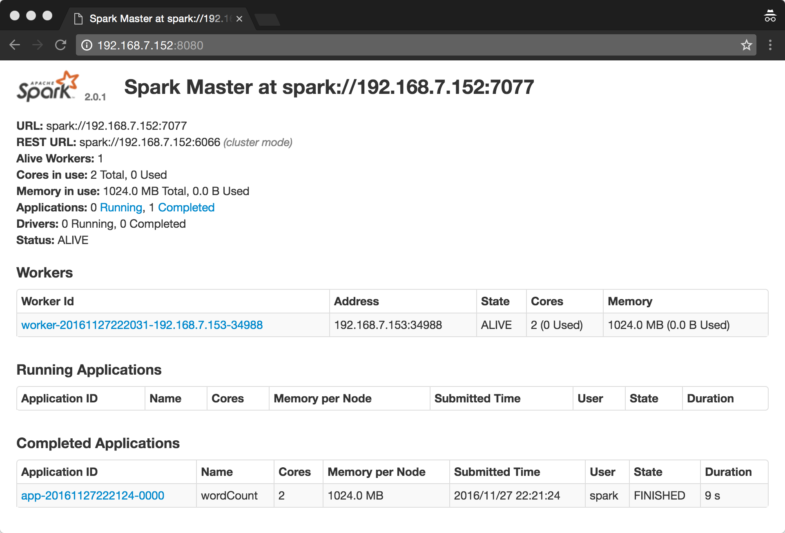

### requirements:

* Vagrant
* Ansible 2.0+
* jdk-8u66-linux-x64.tar.gz

### get start

1. git clone https://github.com/bigdata-labs/analysis-sogou-log.git

2. put jdk-8u66-linux-x64.tar.gz into analysis-sogou-log/ansible/jdk8/files folder. Sorry for this, you must download jdk by yourself. :P

3. cd kafka-spark-labs

4. vagrant up    

   P.S. startup machines for own experiments

5. ansible-playbook ./ansible/playbook.yml -i ./ansible/inventory -u vagrant -k 

   P.S. All machine's password is the same `vagrant`

   install kafka, spark, zookeeper and so on. it'll take a few minutes.

6. Assembly our Java code in sogouAnalysis: `mvn assembly:assembly` 

   P.S. It'll genergete two jars that will be submitted to spark's cluster to run

7. ansible-playbook ./ansible/deploy-playbook.yml -i ./ansible/inventory -u vagrant -k

   P.S. This step will upload sample data and jars that previews step genertate to spark's cluster, then submit spark's job.

8. A few minutes later, open http://192.168.7.152:8080 to look up Spark webui to get the reult.

